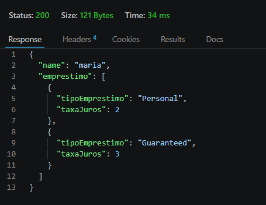

# Empréstimo API

API desenvolvida em Java e Spring Boot para determinar quais modalidades de empréstimo estão disponíveis para um cliente com base em regras de negócio específicas.

---

# Técnologias utilizadas

* Java 21
* Spring Boot
* Maven
* Lombok

---

## Regras de negócio

O sistema analisa três modalidades de empréstimo:

| Tipo        | Taxa de juros |
| ----------- | ------------: |
| PERSONAL    |            4% |
| GUARANTEED  |            3% |
| CONSIGNMENT |            2% |

### Empréstimo Pessoal (PERSONAL)

Concedido quando:

A renda do cliente é menor ou igual a R$ 3.000;

**ou**

A renda está entre R$ 3.000 e R$ 5.000, o cliente possui menos de 30 anos e reside em São Paulo (SP).

---

### Empréstimo Consignado (CONSIGNMENT)

Concedido quando:

A renda do cliente é maior ou igual a R$ 5.000.

---

### Empréstimo com Garantia (GUARANTEED)

Concedido quando:

A renda do cliente é menor ou igual a R$ 3.000;

**ou**

A renda está entre R$ 3.000 e R$ 5.000, o cliente possui menos de 30 anos e reside em São Paulo (SP).

---

## Endpoint

### POST /emprestimo

Retorna os empréstimos disponíveis para um cliente.

---

## Exemplo de requisição

```json
{
  "age": 26,
  "cpf": "275.484.890-23",
  "name": "Maria Silva",
  "income": 7000.00,
  "location": "SP"
}
```

---

## Exemplo de resposta

```json
{
  "customer": "Maria Silva",
  "loans": [
    {
      "type": "PERSONAL",
      "interestRate": 4
    },
    {
      "type": "GUARANTEED",
      "interestRate": 3
    },
    {
      "type": "CONSIGNMENT",
      "interestRate": 2
    }
  ]
}
```

## Exemplo de resposta

Resposta obtida através do Thunder Client.


---

## Estrutura do projeto

```text
src/main/java
│
├── controller
├── dto
├── entity
├── enums
└── services
```

---

## Testando a API

As requisições foram testadas utilizando o Thunder Client.

---

## Melhorias futuras

- [ ] Adicionar documentação com Swagger/OpenAPI
- [ ] Implementar testes unitários com JUnit e Mockito
- [ ] Adicionar tratamento global de exceções
- [ ] Dockerizar a aplicação

---
